#An Analysis of Individual Campaign Contributions for the 2016 Presidential Election in the state of Pennsylvania#

##by Scott Tse##

April 18, 2017

========================================================


##Introduction##

The Federal Election Commission collects and maintains campaign finance contribution data for each election cycle. The FEC's mission is to administer and enforce the Federal Election Campaign Act (FECA) whose laws provide limits for political contributions and oversee public funding to presidential campaigns. Maintaining fairness and ethics in elections is perceived to be an important aspect of democracy in the US.This dataset, obtained from the [FEC website](http://fec.gov/disclosurep/pnational.do) is comprised of individual's contribution data for the state of Pennsylvania for the 2016 presidential campaign cycle. 

In the aftermath of the 2016 US presidential election and the suprising election of Donald Trump, I wanted to look at a state has been traditionally "blue" in recent history but went "red" in the last election. Regardess of political affiliation, most agree that President Trump's populist ascendancy and election were unexpected and many pundits predicted he would lose the election to Hillary Clinton. 

In this report, I perform an exploratory data analysis of this dataset and attempt to explore several research questions such as the following:

* How much money was contributed in Pennsylvania?
* How much did each candidate/political party recieve?
* Did this change over time?
* How do contributions vary over geography?
* Is there anything in the dataset that gave hints to Trump's rise or the eventual election result?

A description of the dataset if provided below. The data dictionary was obtained from the FEC site:
ftp://ftp.fec.gov/FEC/Presidential_Map/2016/DATA_DICTIONARIES/CONTRIBUTOR_FORMAT.txt


**Data Dictionary**

*Data Type:  S = string (alpha or alpha-numeric); D = date; N = numeric*  

|Variable  | Description    | Data Type    |Full Description                                                    |
|----------|----------------|--------------|--------------------------------------------------------------------|
|CMTE_ID	 | COMMITTEE ID   |			S        |9-character alpha-numeric code assigned to a committee by the Federal Election Commission| 
|CAND_ID	 | CANDIDATE ID		|		  S        |9-character alpha-numeric code assigned to a candidate by the Federal Election Commission
|CAND_NM|			CANDIDATE NAME|				S|
|CONTBR_NM|		CONTRIBUTOR NAME|			S|Reported name of the contributor.
|CONTBR_CITY|		CONTRIBUTOR CITY|			S|Reported city of the contributor.
|CONTBR_ST|		CONTRIBUTOR STATE	|		S|Reported state of the contributor
CONTBR_ZIP|		CONTRIBUTOR ZIP CODE|			S|Reported zip code of the contributor
CONTBR_EMPLOYER|		CONTRIBUTOR EMPLOYER	|		S|Reported employer of the contributor
CONTBR_OCCUPATION	|CONTRIBUTOR OCCUPATION|		S|Reported occupation of the contributor
CONTB_RECEIPT_AMT	|CONTRIBUTION RECEIPT AMOUNT	|	N|Reported contribution amount
CONTB_RECEIPT_DT|	CONTRIBUTION RECEIPT DATE	|	D	|Reported contribution receipt date.  The date format is DD-MMM-YYYY
RECEIPT_DESC	|	RECEIPT DESCRIPTION	|		S |Additional information reported by the committee about a specific contribution
MEMO_CD	|		MEMO CODE	|			S|'X' indicates the reporting committee has provided additional text to describe a specific contribution.  See the MEMO TEXT
MEMO_TEXT	|	MEMO TEXT		|		S|Additional information reported by the committee about a specific contribution
FORM_TP	|		FORM TYPE			|	S|Indicates what schedule and line number the reporting committee reported a specific transaction. 
FILE_NUM	|	FILE NUMBER	|			N|A unique number assigned to a report and all its associated transactions.
TRAN_ID		|	TRANSACTION ID	|			S|A unique identifier permanently associated with each itemization or transaction appearing in an FEC electronic file
ELECTION_TP	|	ELECTION TYPE/PRIMARY GENERAL INDICATOR |S|This code indicates the election for which the contribution was made. EYYYY (election plus election year)


# Univariate Plots Section


```
## 'data.frame':	243796 obs. of  19 variables:
##  $ cmte_id          : Factor w/ 24 levels "C00458844","C00500587",..: 15 7 7 7 6 7 15 15 6 6 ...
##  $ cand_id          : Factor w/ 24 levels "P00003392","P20002671",..: 23 12 12 12 1 12 23 23 1 1 ...
##  $ cand_nm          : Factor w/ 24 levels "Bush, Jeb","Carson, Benjamin S.",..: 22 19 19 19 4 19 22 22 4 4 ...
##  $ contbr_nm        : Factor w/ 56881 levels "'SHELLENBERGER, SYLVIA",..: 43133 29444 29444 29444 27659 26292 39067 39073 50701 4559 ...
##  $ contbr_city      : Factor w/ 2090 levels "","17573-0318",..: 23 418 418 418 1435 1435 423 1574 1435 1253 ...
##  $ contbr_st        : Factor w/ 1 level "PA": 1 1 1 1 1 1 1 1 1 1 ...
##  $ contbr_zip       : int  18103 193352266 193352266 193352266 191064153 191252423 19025 19320 191232506 150651112 ...
##  $ contbr_employer  : Factor w/ 17138 levels "","'NBRACES",..: 7303 10590 10590 10590 10146 6022 7303 7303 10146 7303 ...
##  $ contbr_occupation: Factor w/ 8496 levels "","-","--"," CERTIFIED REGISTERED NURSE ANESTHETIS",..: 3704 4884 4884 4884 6493 7756 3704 3704 6493 3704 ...
##  $ contb_receipt_amt: num  75.3 15 10 10 21.6 ...
##  $ contb_receipt_dt : Factor w/ 682 levels "01-APR-15","01-APR-16",..: 149 78 100 122 110 100 213 531 175 557 ...
##  $ receipt_desc     : Factor w/ 30 levels "","* EARMARKED CONTRIBUTION: SEE BELOW REATTRIBUTION/REFUND PENDING",..: 1 1 1 1 1 1 1 1 1 1 ...
##  $ memo_cd          : Factor w/ 2 levels "","X": 2 1 1 1 2 1 2 2 2 2 ...
##  $ memo_text        : Factor w/ 123 levels "","$0.30 REFUNDED ON 10/26/2016",..: 1 17 17 17 26 17 1 1 26 26 ...
##  $ form_tp          : Factor w/ 3 levels "SA17A","SA18",..: 2 1 1 1 2 1 2 2 2 2 ...
##  $ file_num         : int  1146165 1077404 1077404 1077404 1091718 1077404 1146165 1146165 1091718 1091718 ...
##  $ tran_id          : Factor w/ 243247 levels "A00232E849A8547D58D4",..: 160675 204212 204473 205165 83141 204265 157368 182949 83255 83804 ...
##  $ election_tp      : Factor w/ 6 levels "","G2016","G2106",..: 2 5 5 5 5 5 2 2 5 5 ...
##  $ X                : logi  NA NA NA NA NA NA ...
```

The original dataset consists of 19 variables. Note that the "X" variable, was a dummy column created as an artifact of the import process. It is interesting to note that the original dataset only has one continous numerical value `contb_receipt_amt`. The other variables are factor categorical variables or unique identifiers. 

We start by looking at the distrubtion of the single numerical variable.


<!-- -->

If one looks at just the distribution of all contributions in the dataframe, we can see that there are both positive and negative contributions, which seems strange. There is also a large negative outlier around -90000 dollars. Further research revealed that negative contributions are refunds that can occur for several reasons such as invalid donor ID, over limit contributions, and other reasons. The large negative outlier looks like a very large refund to a particular donor.

Another way we might look at contributions then is to sum the total net contribution (sum of all contributions minus refunds) and then plot those values on a boxplot.


```
## # A tibble: 6 × 3
##                   contbr_nm net_donations transactions
##                      <fctr>         <dbl>        <int>
## 1          BALL, GEORGE MR.         18500            6
## 2          BECKWITH, GEORGE         13500            9
## 3    LENFEST, HAROLD F. MR.         13500            6
## 4           SEGALL, GREGORY         13500            7
## 5 COMBS, WILLIAM H. MR. III         10800            6
## 6             FOLINO, J. A.         10800            1
```


<!-- -->


```
## # A tibble: 6 × 3
##         contbr_nm net_donations transactions
##            <fctr>         <dbl>        <int>
## 1 TALMAN, PETER A      -5000.00            1
## 2   WOLF, MARY G.      -5300.00            2
## 3 LENFEST, HAROLD      -5400.00            2
## 4  PHILLIPS, MARY      -7300.00            4
## 5    FOLINO, J.A.      -8100.00            1
## 6    CARANGI, JOE     -90761.05           83
```


The large negative outlier is the total net contribtuion of the individual in the dataset 'Carangi, Joe'. We also see many other individuals who have negative net contribution amounts. In the specific case of 'Carangi, Joe' I was able to find a [letter](http://docquery.fec.gov/pdf/847/201605100300045847/201605100300045847.pdf) written by the FEC to the Bernie Sanders campaign which cited a number of non-compliant contributions and transactions from 'Carangi, Joe' do appear in this letter. My conclusion then is that this individual, along with others in the dataset who have negative net contributions, were found to violate contribution rules in some way and thus had contributions refunded.

With an understanding of what negative contributions mean, I then look at subsetting just postive contributions as a metric of support for candidate or political party.


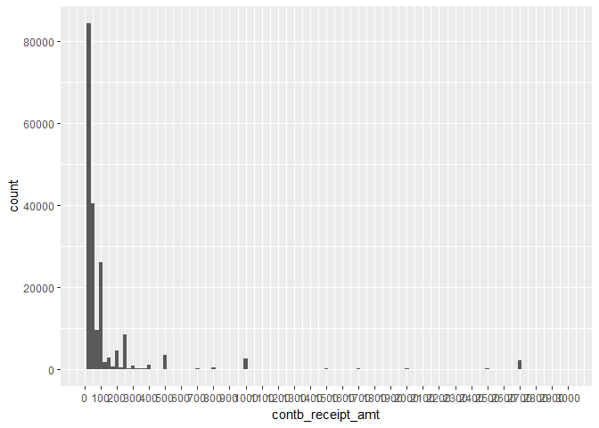<!-- -->

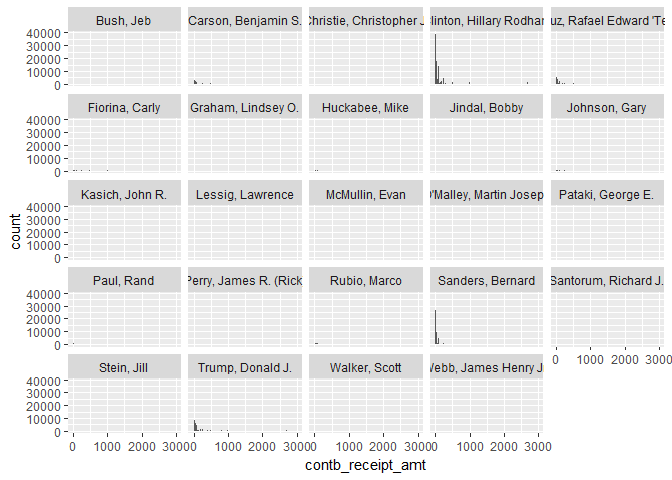<!-- -->

In the faceted histograms above, we can compare the distribution of contribution counts by candidate. We see that most candidate barely register using the existing y axis scale. Althogh hard to tell from the scale, distributions appear rigtht skewed. This makes sense since the contribution amounts have been subsetted to values exceeding zero.


# Univariate Analysis

After some preliminary exploration of the dataset, we understand that the original dataset has effectively 18 variables. There are 243,795 observations, each corresponding to a contribution transaction that occured within the state of Pennyslvania during the 2016 presidential election cycle.

### What is/are the main feature(s) of interest in your dataset?

The main features of interest are the contribution amounts, candidate names, date of transaction and other categorical variables such as city, zipcode. 

### What other features in the dataset do you think will help support your \
Because I want to see if there is anyting in the dataset which foreshadows Trump's eventual victory, I want to pay special attention to trends over time, especially transaction numbers and net donation amounts. 

### Did you create any new variables from existing variables in the dataset?
Yes, I created several:
* created a new variable `can_par_aff` (candidate party affiliation) by merging the candidates dataframe which served as a lookup table for candidate's respective party affiliation.
* created a new variable `zip` which normalizes zipcodes to a 5 digit standard for later joining to shapefiles for zip codes downloaded from data.gov 
* Often, I aggregated the sum of donations to a `net donations` variable and looked at the ratio of net donations to transaction.
* for timeseries analysis, I created variables `Week` and `Month` to enable time based aggregations for easier visualization.


### Of the features you investigated, were there any unusual distributions? \
Did you perform any operations on the data to tidy, adjust, or change the form \
of the data? If so, why did you do this?

Yes, I thought that the distribution of `contbr_amt` was strange since it included not only a large number of negative values, but some very large negative values at that. At various times in my analysis, sometimes I subset the dataset to ignore negatives, and other times I look at aggregations of all transaction. 


# Bivariate and Multivariate Plots Section

After investigating some of the distributions of contributions by candidate, it would also be useful to look at how the data is distributed by candidate party affiliation.

In order to assign a political party affiliation to each candidate and transaction in the dataset I acquired a table of all presidential candidates from the [FEC website](http://www.fec.gov/data/CandidateSummary.do?format=html&election_yr=2016). This `candidates` dataframe was then merged with the `pa_data` dataframe, joining on `cand_id` to enable summaries and visualizations. Here is the lookup table after importing into R:


```
##     cand_id       can_id can_par_aff
## 1 P60013794 A WANDRLUSTR         NAP
## 2 P60016326       ABABIY         PAF
## 3 P60005840       ABBOTT         IND
## 4 P60012838   ABDULHAMID         IND
## 5 P60014461  ABLEIDINGER         DEM
## 6 P60020690         ABLO         IND
```


```r
#merge candidates.cleaned and pa_data to add candidate party affiliation to dataframe
pa_merged <- merge(pa_data,candidates.cleaned,by="cand_id")
```


What was the ratio of total transactions for Democratic versus Republican candidates?


```
##   dem_trans rep_trans dem_rep_ratio
## 1    179087     63943      2.800729
```

Contribution-wise, Pennsylvina was heavily tilted to the Democratic party. The ratio of contribution transactions for Democratic vs Republican candiates was about 2.8 to 1.


```
## # A tibble: 6 × 2
##   can_par_aff net_donations
##        <fctr>         <dbl>
## 1         DEM   15644966.22
## 2         REP   10497917.81
## 3         LIB      93322.61
## 4         GRE      51106.73
## 5         UNK       4900.00
## 6         IND       3432.50
```

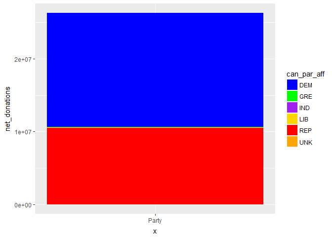<!-- -->


For total net donations, the Democrats again come out on top, outraising Republicans by about $514K, a difference of about 49% more. The Libertarian Pary was a distant third.


```
## Source: local data frame [24 x 4]
## Groups: cand_nm [24]
## 
##                      cand_nm can_par_aff net_donations transactions
##                       <fctr>      <fctr>         <dbl>        <int>
## 1    Clinton, Hillary Rodham         DEM    12832937.5       119288
## 2           Trump, Donald J.         REP     4181681.3        30828
## 3           Sanders, Bernard         DEM     2333003.3        59627
## 4  Cruz, Rafael Edward 'Ted'         REP     1344186.2        15544
## 5               Rubio, Marco         REP      896039.8         3094
## 6        Carson, Benjamin S.         REP      871031.4         9800
## 7            Kasich, John R.         REP      607373.1         1019
## 8                  Bush, Jeb         REP      453837.0          545
## 9   Christie, Christopher J.         REP      416191.0          307
## 10            Fiorina, Carly         REP      318830.8          965
## # ... with 14 more rows
```

The table above summarizes net donations and number of transactions for each candidate in the dataset. We see that Hillary Clinton by far has the most net donations as well as number of contribution transactions, followed by her opponent in the general election, Donald J. Trump, then Democratic primary runner up, Bernie Sanders, and then Republican primary runner-up, Ted Cruz.


What is the distribution of contribution transaction by reported occupation?

```
## # A tibble: 8,470 × 3
##                         contbr_occupation net_donations transactions
##                                    <fctr>         <dbl>        <int>
## 1                                 RETIRED     4823893.5        55594
## 2                                ATTORNEY     1529905.2         5909
## 3                   INFORMATION REQUESTED     1514763.2        10268
## 4                            NOT EMPLOYED      843374.0        17389
## 5                               PHYSICIAN      838826.2         5729
## 6                               HOMEMAKER      817707.9         3949
## 7  INFORMATION REQUESTED PER BEST EFFORTS      531658.4         1530
## 8                               PROFESSOR      517581.0         5817
## 9                               PRESIDENT      515914.2          967
## 10                             CONSULTANT      488822.7         2739
## # ... with 8,460 more rows
```

There are 8470 distinct occupations in the dataset. The top 10 are listed above. Interestingly, "RETIRED"" is the top occupation with highest net donations, followed by attorney. The third category is "INFORMATION REQUESTED" which seems that an attempt was made to gather the occupation information but somehow was unsuccesful. Some work could be done to clean and compress the number of occupations in the dataset (for instance, both LAWYER AND ATTORNEY appear multiple times), but this is outside the scope of this initial analysis. Such cleaning and compression would be needed to get any value out of analyzing contribtuion by 


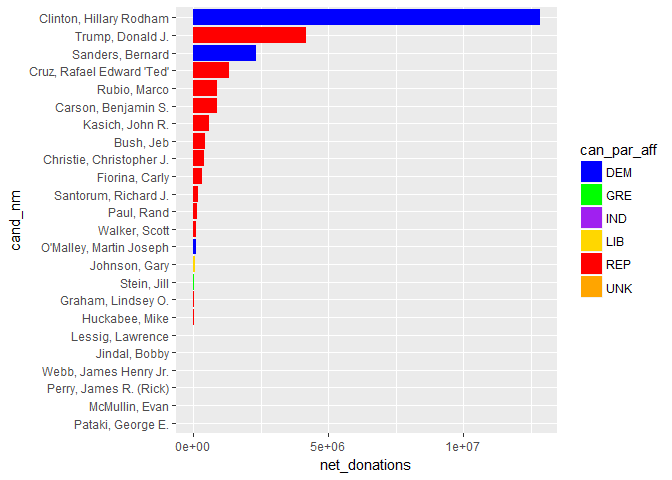<!-- -->

In the barplot above we plot the net donations by candidate, colored by political party affiliation. Although Hillary Clinton is the clear leader by far, eight out of the top ten candidates for net donations are Republican.

<!-- -->

A similar distribution is observed for the barplot of number of transactions for candidate, colored by part affiliation.

<!-- -->

If we look at the ratio of net_donations/transaction which gives us a measure of the size of each donation recieved per candidate, the leading candidates are on the smaller end of the scale. Although interesting to observe, this chart does not appear to have much significance since the candidates who dominate the election cycle do not have the higher net_donations per transaction. Top net_donation per transaction candidates Chris Christie, Martin O'Malley, and Jeb Bush all fell by the wayside fairly early during the primary season.


```
## Source: local data frame [3,423 x 4]
## Groups: contbr_city [2,082]
## 
##      contbr_city can_par_aff net_donations transactions
##           <fctr>      <fctr>         <dbl>        <int>
## 1   PHILADELPHIA         DEM     3288858.2        30780
## 2     PITTSBURGH         DEM     1895003.8        18247
## 3     PITTSBURGH         REP      773767.9         3224
## 4   PHILADELPHIA         REP      392149.4         1738
## 5      WYNNEWOOD         DEM      248333.2         1371
## 6      BRYN MAWR         DEM      246330.7         1243
## 7  STATE COLLEGE         DEM      224549.9         2650
## 8       SCRANTON         DEM      212405.5          714
## 9      LANCASTER         REP      197345.8         1027
## 10     HAVERFORD         DEM      193640.3          907
## # ... with 3,413 more rows
```

In the table above, we explore the net_donations and number of transactions per city for each party affiliation. As expected, we see the major metro areas of Philadelphia and Pittburgh at the top of the list. Seven out of the top 10 city-party aggregated net donations are for Democratic candidates, which seems consistent with the widely known fact that major urban population centers tend to vote Democratic.


```
## # A tibble: 29,770 × 3
##    contbr_zip net_donations transactions
##         <int>         <dbl>        <int>
## 1       19382      48285.64          236
## 2       19041      41359.57           69
## 3       18940      40434.15          250
## 4       19380      39279.42          262
## 5       15143      38978.93          211
## 6       15317      38732.48          202
## 7       15241      38423.97          149
## 8       15238      38229.83          116
## 9       15301      37058.38          145
## 10      19073      37014.62          161
## # ... with 29,760 more rows
```

When we look at distribution of zip codes, we see 29K zip codes which is impossible since it exceeds the total number in Pennsylvania! I noticed many are 5 digit but some are 9 digit. I the create a column with only zips truncated to only 5 digits.


```
## # A tibble: 1,639 × 6
##      zip net_trans_dem net_trans_rep fraction_dem net_donations
##    <chr>         <int>         <int>        <dbl>         <dbl>
## 1  15004             1             0            1        100.00
## 2  15007             1             0            1         27.00
## 3  15047             1             0            1        100.00
## 4  15081             2             0            1        200.00
## 5  15104            24             0            1       2758.00
## 6  15127             9             0            1        310.00
## 7  15260             2             0            1        120.00
## 8  15265             1             0            1         20.00
## 9  15282             1             0            1        250.00
## 10 15289            20             0            1        901.23
## # ... with 1,629 more rows, and 1 more variables: transactions <int>
```

Only 1639 rows coresponding to distinct zip codes now. Much better. 

<!-- -->

Visualizing net donations by zip code this way is not very helpful. The number of zipcodes and lack of spatial context are not informative. 

# Analysis

In the plots above, we added the dimension of party affiliation to see how the data looked when broken down by party. We can clearly see the edge in fundraising that the Democratic party had in Pennsylvania, and more specifically, Hillary Clinton's dominance in that state, eclipsing all other candidates of both parties. While the Democratic party's contributions were concentrated among its two main candidates, the Republican contributions were distributed amongst a larger pool of individuals. We could also see in the data that Bernie Sanders was the third hightest candidate for fundraising, yet had the smallest amount per transaction, perhaps reflecting the grassroots and populist nature of his campaign. The Libertarian and Green party barely register in the contribution data. 


As metioned above, I attempt visualzing the zipcode data in choropleth maps. Using QGIS, I edited a shapefile of USA shapefiles clipped to just Pennsylvania and load it into R.


```r
pa_zips2 <- readShapeSpatial("pa_zip_gm.shp")
names(pa_zips2)
```

```
##  [1] "ZCTA5CE10"  "GEOID10"    "CLASSFP10"  "MTFCC10"    "FUNCSTAT10"
##  [6] "ALAND10"    "AWATER10"   "INTPTLAT10" "INTPTLON10" "count"
```


```
## [1] 43920 17005 17006 17007 17009 17010
## 1952 Levels: 07823 07825 07827 07832 07833 07851 07881 08010 08014 ... 44454
```

```
## [1] "SpatialPolygonsDataFrame"
## attr(,"package")
## [1] "sp"
```

Test plotting shapefiles for Pennsylvania zipcodes.
<!-- -->


<!-- -->

In the choropleth above, we have shaded polygons corresponding to zipcodes, colored by the log of net donations. I peformed the transformation to better contrast each zip code. As expected, we can see that the zipcodes around dense major metro areas surrounding Pittsburg in the SW  as well as Philadelphia in the SE of the state show the highest net donations. 

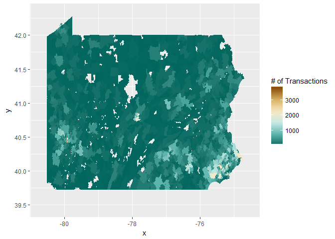<!-- -->
In the choropleth above, we have shaded polygons corresponding to zipcodes, colored by number of transactions. Similar to the choropleth of net donations by zipcode, Philadelpha and Pittsburg areas show highest number of transactions.


<!-- -->

The choropleth above plots fraction of transactions to Democratic candidates for each zip code. This plot is quite interesting since one can see quite a diverse spectrum throughout the state. Philadelpia and its surrounding areas are clearly blue, but once can see very deep pockets of red throughout the state especially in the central portion of the state. In this central area, pockets of deep blue lay adjacent often times to areas of deep red. In addition, the area around Pittsburg does not appear as monolithically blue as Philadelphia, perhaps indicating more political diversity. The city of Pittsburg itself is a blue zone, but it quickly shifts to lighter blue and light red in suburban zones. 

I also wanted to investigate how the varialbes behaved over the dimension of time. 

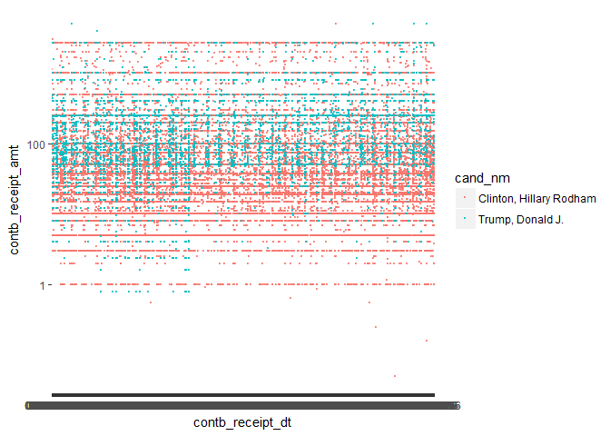<!-- -->

Above, I attempt to scatterplot all contribution amounts over the election cycle to see if one can discern any clear trend. There isn't anyting obvious to pick up here. In order to see anything meaningful, I needed to do some time aggregations and make some line plots.


```r
sapply(pa_merged_test,class)
```

```
##           cand_id           cmte_id           cand_nm         contbr_nm 
##          "factor"          "factor"          "factor"          "factor" 
##       contbr_city         contbr_st        contbr_zip   contbr_employer 
##          "factor"          "factor"         "integer"          "factor" 
## contbr_occupation contb_receipt_amt  contb_receipt_dt      receipt_desc 
##          "factor"         "numeric"            "Date"          "factor" 
##           memo_cd         memo_text           form_tp          file_num 
##          "factor"          "factor"          "factor"         "integer" 
##           tran_id       election_tp                 X            can_id 
##          "factor"          "factor"         "logical"          "factor" 
##       can_par_aff               zip 
##          "factor"       "character"
```


After creating `Week` and `Month` variables, we check the dataframe to verify the datatypes.

```
##           cand_id           cmte_id           cand_nm         contbr_nm 
##          "factor"          "factor"          "factor"          "factor" 
##       contbr_city         contbr_st        contbr_zip   contbr_employer 
##          "factor"          "factor"         "integer"          "factor" 
## contbr_occupation contb_receipt_amt  contb_receipt_dt      receipt_desc 
##          "factor"         "numeric"            "Date"          "factor" 
##           memo_cd         memo_text           form_tp          file_num 
##          "factor"          "factor"          "factor"         "integer" 
##           tran_id       election_tp                 X            can_id 
##          "factor"          "factor"         "logical"          "factor" 
##       can_par_aff               zip              Week             Month 
##          "factor"       "character"            "Date"            "Date"
```


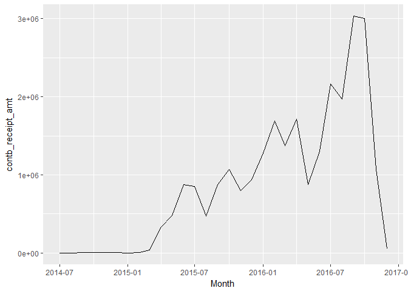<!-- -->

This plot of all contributions aggregated by month shows the increasing trend of contributions leading up to election day. Other than some periodic dips the trend is increasing from the first half of 2015 through late 2016.

<!-- -->

This plot of contributions by week for each candidate shows the two presidential candidates for each respective party rising above the fray during the late stages of the primaries and then through November 2016. 


<!-- -->


This plot is similar to the on above, but we only look at the two eventual major party nominees. Interestingly, Trump's fundraising in Pennsylvania does not start to rise significantly until around May 2016 which seems to conincide with the Pennsylvaia primary which was held on April 26. Clinton's contributions also reach an inflection point at the same time, but her contributions were higher and already rising in the year before the 2016 primary.

<!-- -->

This is a similar weekly timeseries plot, comparing number of weekly transactions for the two candidates.


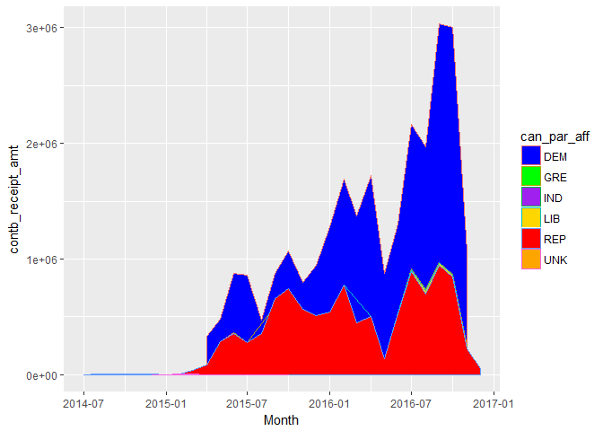<!-- -->

# Analysis

From the timeseries plots above, we see some interesting trends. We see the general trend of increasing contributions coming to a crescendo at the time of the November 2016 general election. We can also see that Trump's contribution activity is quite muted until he wins the state primary in late April 2016. Even then, his contributions rise quite quickly but then plateau in June 2016 whereas Clinton's contributions continue to rise steeply until the general election. 

------

# Final Plots and Summary

In my opinion, these were the three most interesting plots from EDA: 1) Net Donations by Candidate, 2) Fraction of Contributions to Democratic Party by Zipcode, and 3) Candidate Contributions by Month.

### Plot One
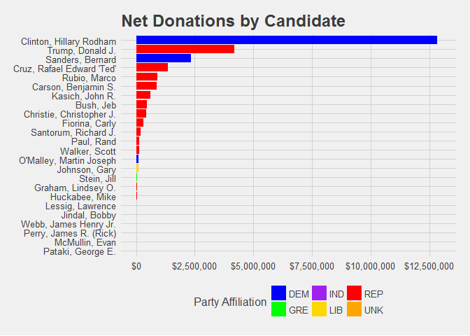<!-- -->

### Description One
For total net contributions, Hillary Clinton dominates the landscape, out-raising all of her opponents and more than doubling the total of Donald Trump within the state. Republican candidates, however, comprise 8 of the top 10 candidates, illustrating the larger field in that party's primary for this election cycle.

### Plot Two
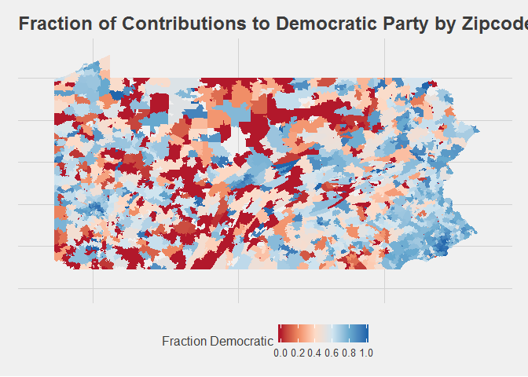<!-- -->

### Description Two
This plot helps show the relative contribution support of Democratic Candidates over teh state. We see stronger financial Democratic support especially in the East portion of the state near Philadelphia. Pittsburg also appears to have a cluster of zipcodes leaning Democratic, but seems more balanced, politically. The visualizaiton appears to support the conventional wisdom that dense urban areas tend to support the Democratic Party whereas exurb and rural regions tend to support the Republican party. It would be interesting to compare this plot for the previous election cycles where Pennsylvania voted Democratic.

### Plot Three
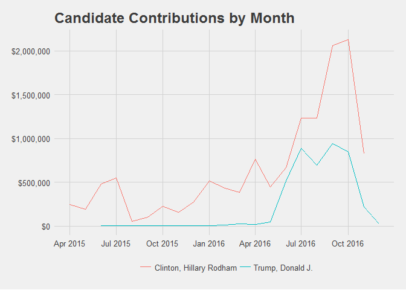<!-- -->

### Description Three
This plot of monthly contribution totals for each nominee shows Hillary dominating Donald Trump within the state. Trump's fundraising looks to plateau by June of 2016, whereas Hillary is able to ride another fundraising bump in Septeber and October before the general election.


------

# Reflection

This EDA excercise and journey through Pennsylvania's contribution data for last general election was interesting. It enalbed me to try out some of R's spatial analysis capabilties using packages I had not previously been exposed to yet (rgeos, maps, mapdata, maptools). I had some trouble layering geom_map objects onto a basemap however, so an obvious next step is to further experiment and practice building basemaps. I was able to pull up basemaps using maptools and ggmap but layering the choropleth polygons proved problematic. I was able to get a decent enough visualization without basemaps but it would certainly be appropriate for the next exercise.

I was hoping to find some information or trend in the contribution data which might have proved prescient regarding Donald Trump's eventual general election victory. However, after investigating the contribution data overall as well as over time, it's difficult to see any metric that indicated that Trump would eventually win Pennsylvania. In fact, given how close the election was there, I thought the contribution data would also reflect this parity. The opposite was in true, since Hillary Clinton so obviously dominated fundraising. My conclusion is that for at least the last election cycle, fundraising performance within the state was not a good predictor of general election support. There were seemingly many voters who turned out for Trump that did not contribute in advance.  


